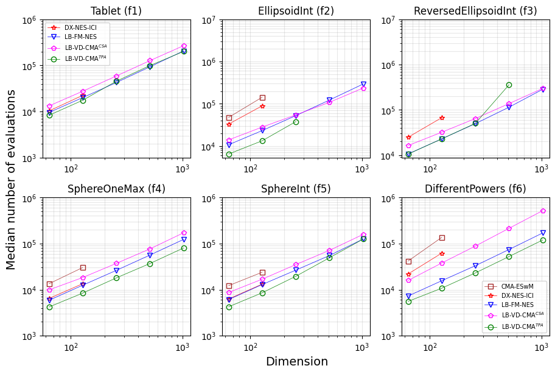

# Toward Efficient Mixed-Integer Black-Box Optimization via Evolution Strategies with Plateau Handling Techniques
This repository contains the official code for our paper, *"Toward Efficient Mixed-Integer Black-Box Optimization via Evolution Strategies with Plateau Handling Techniques"* accepted at GECCO 2025.



# Citation

If you use our source code, please cite our work as:

```bibtex
@inproceedings{AnhGecco2025,
  author       = {Tuan Anh Nguyen and Ngoc Hoang Luong},
  title        = {{Toward Efficient Mixed-Integer Black-Box Optimization via Evolution Strategies with Plateau Handling Techniques}},
  booktitle    = {GECCO '25: Proceedings of the Genetic and Evolutionary Computation Conference},
  address      = {Málaga, Spain},
  publisher    = {{ACM}},
  year         = {2025}
}
```
